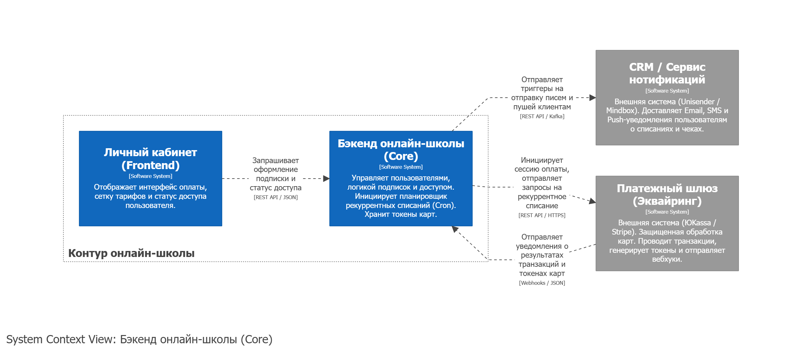

# Проект 1: REST API — Интеграция с платежным шлюзом (Сценарий подписок)

## Бизнес-сценарий
Проектирование функционала автоматического рекуррентного списания средств (модель подписки) для онлайн-школы. 
1. **Первичное оформление**: Пользователь в Личном кабинете выбирает тариф подписки и нажимает «Подписаться».
2. **Привязка карты**: Система генерирует платежную сессию. Пользователь вводит данные карты на защищенной форме платежного шлюза. Шлюз проводит первый платеж и генерирует уникальный токен карты, который Backend онлайн-школы сохраняет в профиль пользователя.
3. **Рекуррентное списание**: Через 30 дней Backend онлайн-школы по триггеру планировщика задач отправляет в шлюз запрос на автоматическое списание стоимости следующего месяца, используя сохраненный токен.

---

## 1. Контекстная диаграмма (C4 Context)

Система онлайн-школы взаимодействует с Пользователем, внешним Платежным шлюзом и внешней CRM-системой.



---

## 2. Диаграмма последовательности (Sequence Diagram)

Диаграмма описывает два этапа: первичное оформление подписки с привязкой токена карты и автоматический цикл рекуррентного списания через 30 дней с обработкой успешных и неуспешных исходов.

![Sequence Diagram](https://www.plantuml.com/plantuml/png/bLLDJnjN5DtFhxXoDxO4vIExLAu2X4QeBR4AQRj0GkEPHnWnda7pGP9TZ9j01IfLLfMgbD9kkgba20ORiFaBx_sZdFVc3NucauWa4lCnxvvxxpddNZ-84pjAqePlsMaI1ccZpY8htl22JJko6pGRFg_Phki5JsbgqdXVGv3dU9jsa1ZVBTj9meXA_90F-ANOv-Uudl2ssEOT-LmYEwOdCJBKm-SuTiIxega-Nl4suMoVN_8sx_7-kDZb5mfahqHVVESzNKzc_PHPcyEyYFyJyJkyB_PuZt2ypOzv5nWTiRqIbB-9mY1XWLjHMTNJQFYixMpWEuxEXH7BZkbtj_8SghBwoFPIDYH-HPeBn2qvwynDVHPDp04-Gv1t5Y08BHR1g7RFygB_GuU_yNDWpTGMCe17TiAUsIz6O-T--9uc28HrKCA9f6qbG443e7N5Bx8S8B_6jQSmSDoogbNY_-D0cr_Jr7r2-ZnuHuRo3XX7x00lhr1PHpOeNtQ9N-DT5uqUG44Wau9_ARR57bMhbbIGnh_EE0NmMwGumtc8ABdN-f_oQrcdx5ZiG-Q3agK249dJV9zgZvUMQM9hQY9Ewx4JUPk95mOnbM5ARsrjrNChqbFU5ZYvqKPVHt30p02rdcRPq81Hm8LehGJIP-fZIpIfIhNvnOSBYuzCBCsxKTEc_QB1WWJbs8qm3P8nYfYJHX7SNasYb5Ki7KFZPYtJarDm0SCdbyeQOpMD_37A7z3MC7DEvCS3AvRBFc1XIAQK8vTNgTXM-hNvYQagNbEkjcZ9ORjMTeIcMb230lu6mM2G9AC8XLl5AzC5lAiv1gidAl4PZkfaGrfCoAFS3xeYqLJbdk8A3CjQ3D5TkCMYF6RCaFTt17PHnYirWNtjNz6IoP5uCEBWya-ilXw66uO-HPPxbfsASvsfFDHdZB0NapIkngdZCEOoLufVztmV7wkb9DnOjUlErFIzqcSOL5MlsfSc7U9zXLa-CkmvwbvGNQMPkUM57-U7o0QpiCqaFVxMp8hnHyP_r12_mt_eW-U_a48RGrUGpxcSMYK3xcx8pVABVL0xA3IWkL-cWVytWZ5hS8Yo8RvebPgtb2-B7UtLSxetAJtMntsl8dUBN9y6SGLj72eFjmrOrKjcFvJxJdhp70TkBm7wkLYgEy__7IoWGGeNWnQAofcrneX5KHYjEg7B2BqruU2kkf7zw9aVHRLiFo5OvNKsvegO7ar_ARVxlv8FHEz-Z7MT5YHJwSRLg9tmhz2nXy07WRAimgMgTeefuAYDXwvL6JxVdN0934L8UcoiAwmNviUiY8Pf1REBfsEvgcvH80v6A5YpFV_J_Vy15rsf5BgUvYTc5BrBDcepIykh3v_CKvc_GT7gP_5KIz0TMRgLkz7oziFVU3IYVc5L2PUgFB0otCwjaWN8ef5zW3zfmtyF)

---

## 3. Пример тела запроса

Запрос отправляется Бэкендом онлайн-школы в Платежный шлюз методом `POST /v1/payments`. Сумма передается в минимальных единицах валюты (в копейках) для исключения ошибок округления.

<details>
<summary>📂 Нажмите, чтобы развернуть и посмотреть JSON запрос</summary>

```json
{
  "amount": 199000,
  "currency": "RUB",
  "rebill_id": "tok_platform_987654321",
  "order_id": "ord_2026_09_01_a73b",
  "receipt": {
    "customer": {
      "email": "student@email.com"
    },
    "items": [
      {
        "description": "Подписка на курс: Системный анализ (1 месяц)",
        "quantity": 1,
        "price": 199000,
        "vat_code": 1
      }
    ]
  },
  "metadata": {
    "subscription_id": "sub_991823",
    "course_id": "crs_analytics_pro"
  }
}
```

</details>

---

## 4. Идемпотентность транзакций
Для предотвращения повторных списаний денежных средств при сетевых сбоях (когда банк деньги списал, но ответ до Backend онлайн-школы не дошел), на методе `POST /v1/payments` реализована поддержка идемпотентности:
*   В HTTP-заголовках запроса передается обязательный ключ `Idempotency-Key` (UUIDv4).
*   Ключ генерируется уникальным под конкретный заказ расчетного периода (`order_id`). При повторной отправке запроса с тем же ключом шлюз не проводит повторную транзакцию, а возвращает закэшированный результат первой успешной обработки.

---

## 5. Справочник бизнес-ошибок
При возврате статуса `"status": "failed"` шлюз возвращает HTTP-код `200 OK`, но дополняет тело ответа строковым бизнес-кодом ошибки. Обработка на стороне Backend:

| Код ошибки (`error_code`) | Описание ситуации | Логика обработки системой (Backend) |
| :--- | :--- | :--- |
| `insufficient_funds` | На карте клиента недостаточно средств. | Подписка переводится в статус `PAST_DUE`. Назначается Retry-политика повторных списаний (через 1, 3, 7 дней). CRM отправляет пуш «Пополните баланс». |
| `card_expired` | Истек срок действия банковской карты. | Списания прекращаются. Подписка уходит в `HOLD`. Клиенту высылается нотификация с требованием обновить/привязать новую карту. |
| `card_blocked` | Карта заблокирована банком или утеряна. | Аналогично `card_expired` — немедленная остановка списаний, перевод подписки в `HOLD`. |
| `suspected_fraud` | Транзакция заблокирована антифрод-системой. | Блокировка автоматических транзакций по этой карте. Информирование пользователя о необходимости верификации. |

---

## 6. JSON-схема валидации ответа

Для автоматической валидации ответов от платежного шлюза разработана строгая JSON-схема. В ней зафиксировано бизнес-правило: если `status = failed`, поле `error_code` становится обязательным для заполнения.

<details>
<summary>📂 Нажмите, чтобы развернуть и посмотреть JSON-схему</summary>

```json
{
  "\$schema": "https://json-schema.org",
  "title": "PaymentResponseSchema",
  "type": "object",
  "required": ["payment_id", "status"],
  "properties": {
    "payment_id": {
      "type": "string",
      "pattern": "^pm_[a-zA-Z0-9]+\$",
      "description": "Уникальный идентификатор транзакции в платежном шлюзе"
    },
    "status": {
      "type": "string",
      "enum": ["succeeded", "failed"],
      "description": "Итоговый статус проведения транзакции"
    },
    "error_code": {
      "type": "string",
      "enum": ["insufficient_funds", "card_expired", "card_blocked", "suspected_fraud"],
      "description": "Код ошибки. Обязателен при status = failed"
    }
  },
  "if": {
    "properties": { "status": { "const": "failed" } }
  },
  "then": {
    "required": ["error_code"]
  }
}
```

</details>

*Полный файл схемы валидации также доступен в корне папки проекта.*

---

## 7. Дополнительные технические файлы в этой папке
Для полной демонстрации контракта к проекту приложены сопутствующие артефакты:
*   `openapi.yaml` — Полная Swagger/OpenAPI спецификация метода рекуррентных платежей со всеми заголовками и схемами данных.
*   `sequence-diagram.puml` — Текстовый исходный код диаграммы последовательности (PlantUML).
*   `payments.postman_collection.json` — Файл коллекции Postman, содержащий тестовые запросы с заложенными JavaScript автотестами проверки статус-кодов.

